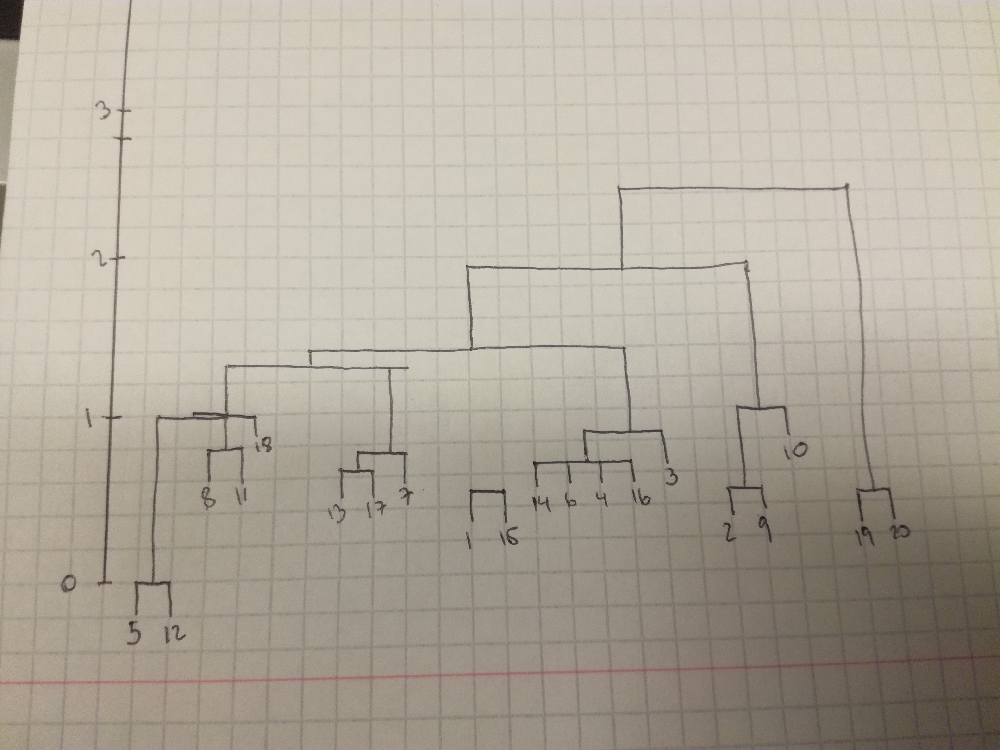
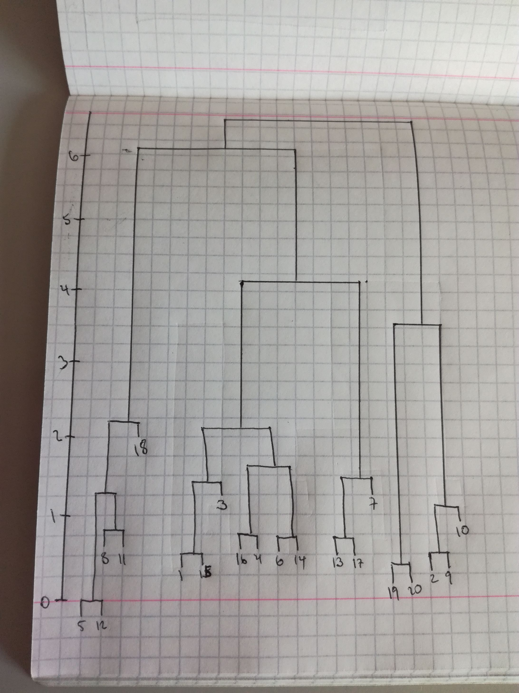
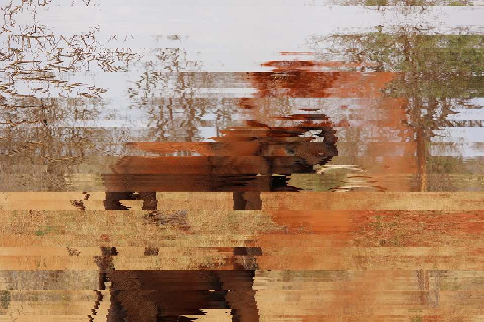

```{r setup, include=FALSE}
knitr::opts_chunk$set(echo = TRUE)
```

# Exercise 1

In order to get the hierarchical clustering dendrograms, the distance was measured first using euclidean distance.

```{r}
x = c(3,4,2.1,4,7,3,6.1,7,4,3,6.2,7,5,3.5,2.5,3.5,5.5,6,0.5,0.8)
y = c(6.1,2,5,6,3,5,4,2,1.5,2,2,3,5,4.5,6,5.5,4.5,1,1.5,1.2)

data = data.frame(x,y)
dist = dist(data)
dist
```

## Single Linkage

```{r}

```

As we can see, the dendrogram itself provides the order of the mergers, since you can see how each element was merged based on the order. For simple linkage, the smallest distance between two points was always chosen.

This is the one generated by R for reference.

```{r}
clust = hclust(dist, method="single")
plot(clust)
```

## Complete Linkage

```{r}

```

As we can see, the dendrogram itself provides the order of the mergers as well, since you can see how each element was merged based on the order. For complete linkage, the distance was considered when there are no smaller distances between the elements that will be clustered.

This is the one generated by R for reference.

```{r}
clust2 = hclust(dist, method="complete")
plot(clust2)
```

# Exercise 2

```{r}
set.seed(20)

xOrdered = c(3, 2.1, 3, 5, 4, 4, 7, 6.1, 7, 4, 3, 6.2, 7, 3.5, 2.5, 3.5, 5.5, 6, 0.5, 0.8)
yOrdered = c(6.5, 1, 5, 5, 2, 6, 3, 4, 2, 1.5, 2, 2, 3, 4.5, 6, 5.5, 4.5, 1, 1.5, 1.2)

dataOrdered = data.frame(x=xOrdered, y=yOrdered)
kmeansResult <- kmeans(data, dataOrdered[1:4,], nstart = 20)
kmeansResult$cluster <- as.factor(kmeansResult$cluster)
library(ggplot2)
ggplot(data, aes(x, y, color = kmeansResult$cluster)) + geom_point()
```

With this code, what is happening is that the four clusters or points that were selected as initial are put first in the data frame so that then we can send them to the kmeans function. It will use these four points for all of its calculations. Also, the initial cluster value is set to 20 because there are 20 points in the data frame. Then, kmeans does it calculations by clustering nearby points first and, when four clusters are achieved, shifting the centroid so that it analyzes all points again with all of this centroids. This process is repeated until the centroids don't change anymore at the end of the clusterization process.

In this code, the clusters are changed to factors so that each one can be colored in a different color. If they're left as numeric, ggplot will do a gradient instead of different colors.

# Exercise 3

```{r}

messy = read.csv("DM2017.txt", sep = " ", header = FALSE, stringsAsFactors = FALSE)
rowNames = messy[,c(1)][-c(1)]
columnNames = messy[c(1),]

messyStripped = messy[-c(1), -c(1)]

distances = dist(messyStripped)
clusters = hclust(distances, method="complete")
plot(clusters)

orderedNumbers <- clusters$order

finalData = data.frame(rowNames, ids = seq.int(640))

finalData$ids <- factor(finalData$ids,levels=orderedNumbers) 
finalData <- finalData[order(finalData$ids),] 

write.table(finalData$rowNames, file = "rows.csv", row.names=FALSE, sep=" ", quote = FALSE)
```

First, the data is extracted from the file. The rows and columns are removed because if we do the hierarchical clustering with them, then it doesn't work because they aren't numerics, but strings. The distances are calculated for the remaining data frame, and then with this distance, hierarchical clustering is executed. This is done with the complete method. I tried all of the other methods available and none look as decent as complete. The dendogram is plotted for informative purposes only, as it is actually not useful for this analysis. Then, because I didn't know how to order the rows directly, I added an ID row so that I could use it to order the row information. To make the usage of this rows easier, I wrote them to a file, which had all of the row IDs in the order that the hierarchical clustering has determined that is the best for it. The end result is this:

```{r}

```

Even though it's obviously not as good as the original, I can say with confidence that the image is a lion in the middle of some kind of dry pasture. There's a tree with green leaves to the right and a tree with dry leaves at the left.

# Exercise 4

## Analysis techniques

First, he had to do some cleaning like we had to do on the first homeworks. Since he got data from various sources, he had to adapt it in different ways, such as adding an indicator for the type of taxi, such as yellow taxi, green taxi, or Uber.

The first two graphs with the maps are points drawn across a map so that it forms the map itself with stronger and weaker colors. The graphs that deal with pickups in different sectors of New York are just normal line graphs that could be done in R easily. They analyze what is happening with Uber, with filtering specific days and plotting them to see the tendency.

However, the graphs that deal with the airports are like a very cool way of box plots. It starts with the analysis of time that it takes to reach the airport, and then it is expanded to showing the information with quantiles.

Then, for the Die Hard analysis, a normal histogram is made to show the most frequent travel times based on filtered data of time and location. For the weather analysis, there's nothing particularly noteworthy to notice other than the author changing the measurements to percents so that it would be easier to compare between regular taxis and Uber.

The analysis for late night pickups could maybe be interpreted as some kind of clustering, although here the author has a clear way of sectorizing the pickups, so it's not a clustering without any parameters, like we do in our assignments. However, it still groups kind of random pickup locations into clusters so that we can see where there are more pickusp and where less.

The B&T is done similarly with a kind of clusterized approach, while a scatter plot over a map was done to get into more details about Murray Hill. Williamsburg analysis also has a regular line graph with an animated scatterplot.

The investment bankers analysis is also made with a regular histogram with the times of arrival of people to a defined location. In the parting thoughts, there are regular line plots for the credit card analysis, with the Cash vs Credit Card by Total Fare Amount graph having several lines, like we do sometimes in ggplot (but these ones look nicer).

In regards to the updates, there are still comparison images using normal line graphs with several lines on top of each other for easy comparison. This is done to analyze the surge of rides done through Uber.

## Business Cases

* Compare the ride data with the coverage from subways and buses. Why are there specific areas with such a high concentration of taxi pickups in residential areas? Is it because the neighborhood is wealthy or because public transportation is deficient?
* Compare high traffic places with the normal headquarters or other kind of branch offices from taxi companies to see if relocating would result in offering customers a quicker experience.
* Now that Uber growth is starting to plateau, and that cheaper competitors such as Lyft are already surpassing regular taxis, what can Uber do to avoid losing market share?
* How does offering promo codes and discounts for specific ride sharing services affect the overall pickups and deliveries of these companies? Does offering promo codes increase the pickups all-around or mostly in specific areas, such as less richer areas of NYC? Perhaps there's a market to be gained there on the basis of cheaper prices?
* What does regular taxi companies can do to improve their performance? Does Uber riders use them because of convenience? Maybe trying to use a similar technological method would reduce their huge losses at the moment.
* Compare drop offs in specific areas with availability of parking around. Does people use taxis because there's no parking around? In case of specific chains or similar, is it affecting sales?
* If there's a lot of pick ups in hardware stores or similar that sell furnitor or other big elements, do offering a promo code of Uber would increase sales? Maybe after a specific purchase amount, a promo code could be offered to ease the burden of carrying stuff around?
* The analysis of night life could be expanded further so that Uber could tweak its surge-pricing algorithm in order to increase prices from and to specific places in a way that it gets more money but it doesn't alineate customers.

# Exercise 5

The report can be found here: https://docs.google.com/document/d/1RTAASwbB9Xs_6IKfEtNmDErWQKxld1NPWBTjxurEJW4/edit#heading=h.k2uf3dxko21l

# Exercise 6

The proposal can be found here, and of course it can be shared with Taxify: https://docs.google.com/document/d/1VWPOJ9_ZofMJ3ijVsO-ErZNnQlA07IjtJLKXuGjOFn4/edit?usp=sharing
