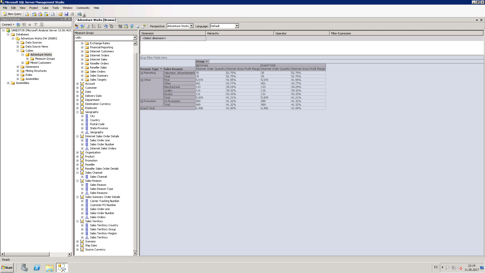
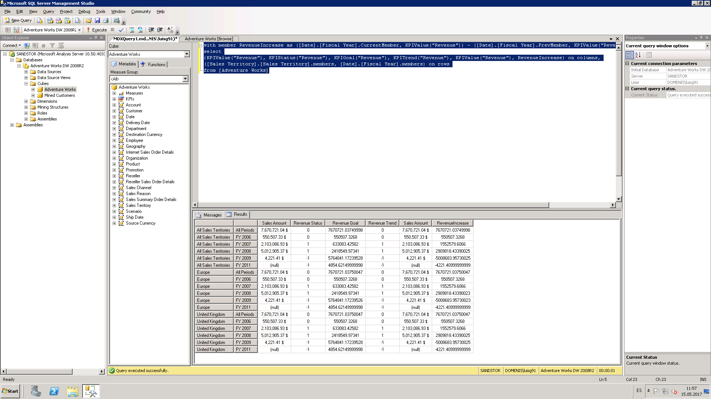
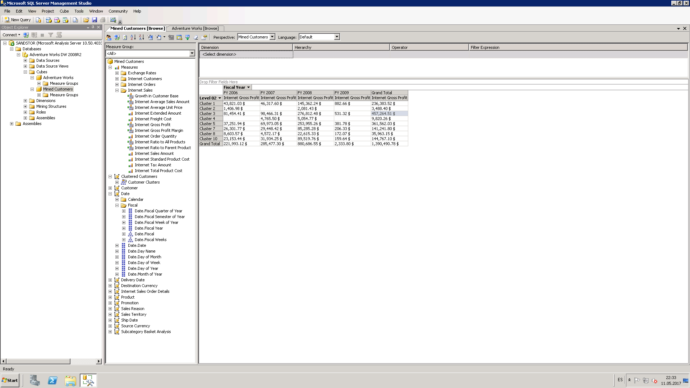
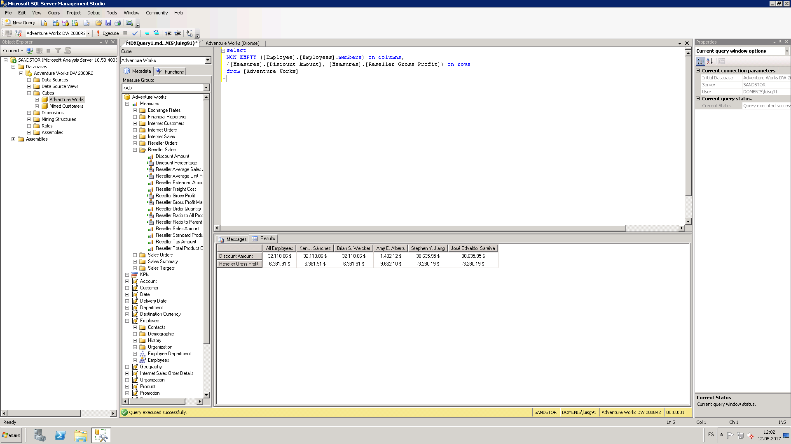
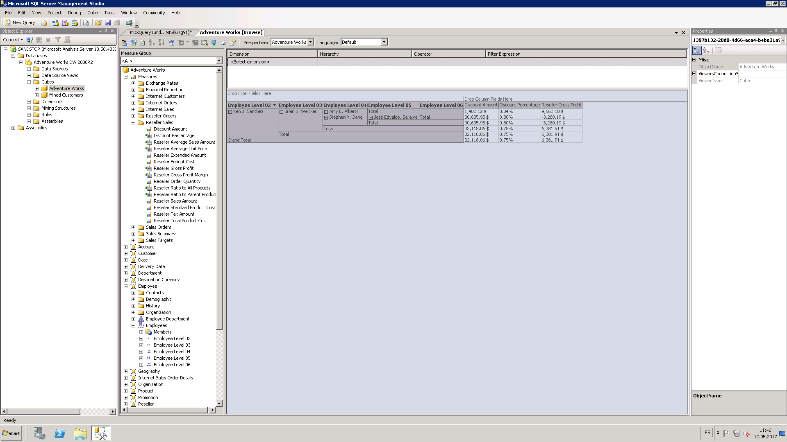

```{r setup, include=FALSE}
knitr::opts_chunk$set(echo = TRUE)
```

# Exercise 1

```{r echo=FALSE}

```

In order to get the result, the regular cube browser in SQL Server Management Studio was used. The sales reason category and reasons were used for the rows, and the territory for the columns. Then the measures Internet Order Quantity and Internet Gross Profit Margin were used as values. We can see that the top 5 for quantity are:

* Price (5570)
* On Promotion (989)
* Other (401)
* Manufacturer (133)
* Review (131)

In the case of internet gross profit margin, the top 5 were:

* Television Advertisement (52.75%)
* Other (43.77%)
* Review (43.33%)
* Price (41.55%)
* On Promotion (41.32%)

# Exercise 2

### Query

with member RevenueIncrease as ([Date].[Fiscal Year].CurrentMember, KPIValue("Revenue")) - ([Date].[Fiscal Year].PrevMember, KPIValue("Revenue"))
select
{KPIValue("Revenue"), KPIStatus("Revenue"), KPIGoal("Revenue"), KPITrend("Revenue"), KPIValue("Revenue"), RevenueIncrease} on columns,
([Sales Territory].[Sales Territory].members, [Date].[Fiscal Year].members) on rows
from [Adventure Works]

### Result

```{r echo=FALSE}

```

### Explanation

First, all of the KPI values were put as columns to see them more easily. Then, sales territories and fiscal years were put as rows, so that each territory is analyzed by each of the available fiscal years.

As we can see, first the figures for all sales amount across all territories are aggregated, and then it gets drilled down to Europe and United Kingdom. Since UK is the only country in the DB, this table is a bit more useful. If there had been a lot of countries, a pivot table would've been better because it lets us show and hide information as needed, while the approach with MDX shows everything without filtering.

I didn't figure out how to get the indicator to show an image like a picture I saw on Piazza, but the values for both Revenue Status and Revenue Goals are very easy to figure out regardless. For the first fiscal year (2006), it is always 0 because that is the first year, so there are no values to compare it to. However, we can see in the case of Revenue Status that for year 2007 in all territories, there's a 1. If we see the Sales Amount, we can infer that the 1 means that the revenue increased compared to previous year. From 2007 to 2008 it also increased so that's why 2008 has a 1 as well. However, for 2009, it has a -1, and that is because the revenue decreased compared to the previous year. Since 2011's value is null, then SSMS assumes that the value has been reduced (probably to 0), so it shows a -1. This indicator does not take into account the magnitude of the values, but just compares if the previous year is bigger or smaller. This is reassured by the RevenueIncrease variable shown at the end.

In the case of the Revenue Trend, what the indicator shows is the comparison between the goal and the actual value. For the first year, values are the same so it shows 0. We can see that in 2007, the sales exceeded the goals, so the value is 1. However, in 2009, the goal was not reached, so the indicator shows -1. This as well doesn't take into account the actual magnitudes of the values, but it's just a simple comparison. 

# Exercise 3

```{r echo=FALSE}

```

To get the result, I opened the Mined Customers cube and put the clustered customers as rows, the fiscal years as columns, and the internet gross profit measure as a value. This yields columns with every fiscal year, so it was a matter of comparing which one had the highest value. In this case, Cluster 1 was the one with the highest profit, with a value of $882.66.

# Exercise 4

### Query

select
NON EMPTY ([Employee].[Employees].members) on columns,
{[Measures].[Discount Amount], [Measures].[Reseller Gross Profit]} on rows
from [Adventure Works]

### Screenshot Query

```{r echo=FALSE}

```

### Screenshot Pivot Table

```{r echo=FALSE}

```

### Explanation

we can see that Jose Edvaldo Saraiva is the employee that gives the highest amount of discounts. Because the employees are arranged into different levels, I am assuming that the higher levels are administrative people and the lower levels are the actual salespeople, so there are actually two salespeople: Jose and Amy. Since Jose is in the lowest level, I am assuming that he's the one who actually carries out the discount. However, he's not the one who brings in the highest profits. In fact, he brings in losses of more than $3000. The one who brings the most profits is Amy E. Alberts, who in fact gives out the least amount of discount.

# Exercise 5

### Adventure Works

This perspective shows everything, so it is perhaps used by either people directly in charge of the datawarehouse, or managerial staff who actually wants to see this kind of information and not only synthesis of it. Since it shows absolutely everything, there's no defined part of the company that might use it, or at least it is not easy to infer.

### Channel Sales

This is very similar to the sales summary perspective, but it gives a bigger focus in geography and also incorporates the employee, something that sales summary doesn't include. This might mean that this perspective is used to evaluate how resellers are doing but with a more granular control. This is based on location, employees involved, promotions, and similar. This could maybe be used by the marketing department in order to pinpoint where products are more successful based on promotions and geography. It could also be used by middle management to see how different products are being sold and adjust accordingly. Compared to direct sales, this includes stuff that is not sold through direct channels, so that the company can assess how goods are being sold by third parties. Maybe if it had a little less information, it could be used by resellers, but as it is right now, it was way too much info.


### Direct Sales

Direct sales deals fully with sales made on the internet portal, that is, sales that don't have a reseller as an intermediary. Number of customers, average unit prices, profit, and similar stuff is analyzed here, so this is probably used by the company to evaluate the effectiveness of its direct sales channels. Probably there's a division of the company only in charge of evaluating the internet portal, so the amount of information available here will be very useful to assess the performance of it and how it can be improved.

### Finance

This perspective has dimensions like destination currency, organization, and account. This means that this perspective is used by the financing department, since they have to deal with the accounts to which they are paying values to, they have to deal with currency exchange for international vendors, and the organizations with whom they are making business with. On the measures, we can also see values related to exchange rate, and the financial reporting measure probably is used to get the totals. For example, I did a test with the amount of financial report by organization level, and it showed the net income of every division of the organization. If I used the account dimension instead, then it showed the net income divided into profits, expenses and taxes.

### Sales Summary

We can assume that the company is in charge of selling some kind of product, so the Sales Summary is probably used by people from the accounting/logistics part of the company. There's details of the product, currencies, date, discounts, and details of the order. With this they can see which products they sell more based on dates, promotions and countries. Since it also includes ship dates and channels, logistics can also use this to see how are their operations going, see which channels are used more and less and try to come up with optimization based on these dimensions. 

### Sales Targets

This is probably used by the manamgenet part of the organization, since it deals directly with the performance of resellers. We can see measures like reseller sales amount which is used to directly assess which resellers are performing the best and the worst. There's also product categories so that users can see which categories are being moved by which resellers and at which dates, so that tendencies can be found and optimizations can be made regarding this.
