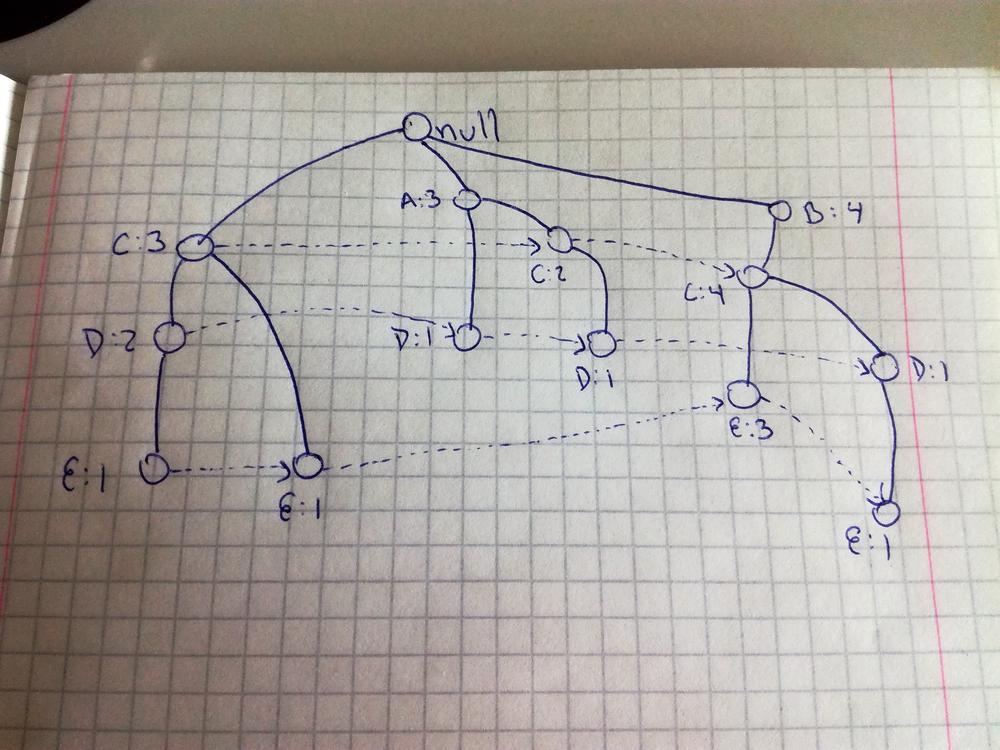

```{r setup, include=FALSE}
knitr::opts_chunk$set(echo = TRUE)
library(ggplot2)
library(reshape2)
library(scatterplot3d)
library(entropy)
library(knitr)
opts_chunk$set(tidy.opts=list(width.cutoff=60),tidy=TRUE)
```

## Exercise 1

#### FP-Tree

```{r, out.width="480px"}

```

#### One item

```{r echo=FALSE}
dataset = matrix(c(3,4,9,5,6), ncol = 5)
colnames(dataset) <- c("A", "B", "C", "D", "E")
rownames(dataset) <- c("Count")
as.table(dataset)
```

#### Two items

```{r echo=FALSE}
dataset = matrix(c(2,2,4,1,4,4,6,2), ncol = 8)
colnames(dataset) <- c("AC", "AD", "BC", "BD", "BE", "CD", "CE", "DE")
rownames(dataset) <- c("Count")
as.table(dataset)
```

#### Three items

```{r echo=FALSE}
dataset = matrix(c(1,1,4,1,2), ncol = 5)
colnames(dataset) <- c("ACD", "BCD", "BCE", "BDE", "CDE")
rownames(dataset) <- c("Count")
as.table(dataset)
```

#### Four items

```{r echo=FALSE}
dataset = matrix(c(1), ncol = 1)
colnames(dataset) <- c("BCDE")
rownames(dataset) <- c("Count")
as.table(dataset)
```

#### Support of 3 and frequent 3-element itemsets

Next, the items with support count of three or more are identified, as well as if they're of three elements (although this should be obvious but anyways).

```{r echo=FALSE}
dataset = matrix(c(3,"N",4,"N",9,"N",5,"N",6,"N",4,"N",4,"N",4,"N",6,"N",4,"Y"), ncol = 10)
colnames(dataset) <- c("A", "B", "C", "D", "E", "BC", "BE", "CD", "CE", "BCE")
rownames(dataset) <- c("Count", "Is3Element")
as.table(dataset)
```

#### Interesting rules

The tree and the support counts let us see that when there's an A value, there's no B or E value. Also, we can see that, even though C is not normally the item that starts the itemsets, it is the most repeated item throughout the sets, failing to appear on only one out of the 10 sets.

We can also see that D and E never appear as the first item. Instead, they're always part of another itemset that has already started with another value. From the FP-Tree it is easy to identify the big amount of BCE combinations that show up, with a total of three of them, and a total of four for BC only. However, there's one that appears in a BCDE combination, bringing the total of BCE to four as well. 

Out of the six paths created at the end (some of the items, such as CD, don't reach the end of the path), four end in E and two in D. There's a big chance of getting CD and CE as combinations within any data set, with both making a presence in four out of the six paths.

## Exercise 2

#### Vertical layout
```{r echo=FALSE}
vertical = data.frame(A=character(), B=character(), C=character(), D=character(), E=character(), stringsAsFactors = FALSE)

vertical[1,] <- c("2","3","1","1","1")
vertical[2,] <- c("5","4","3","2","3")
vertical[3,] <- c("9","8","4","4","4")
vertical[4,] <- c("","10","5","5","7")
vertical[5,] <- c("","","6","6","8")
vertical[6,] <- c("","","7","","10")
vertical[7,] <- c("","","8","","")
vertical[8,] <- c("","","9","","")
vertical[9,] <- c("","","10","","")

vertical
```

It is very easy to generate contingency tables using this layout. The only thing you need to do is verify if the numbers for a association coincide (either in appearing or on not appearing) on all columns.

For example, given that we want to see the contingency table for {B,C} -> {E}, then there are four values we need to generate: when both are present, when none are present, when BC is present but not E, and when E is present but not BC.

Thus, since we know that there are ten transactions, these values need to sum up ten at the end and we go number by number verifying what happens. This transaction is made easy in this case because of the fact that B is only present four times, and these four times coincide with entries in which C is also present, so we can quickly determine which combinations have B and C by just looking at B.

Both appearing -> 3, 4, 8, 10
None appearing -> 2, 5, 6, 9
BC but not E -> NULL
E but not BC -> 1, 7

This forms the following contingency table:

```{r echo=FALSE}

f11 = 4
f10 = 0
f01 = 2
f00 = 4
total = f11+f00+f10+f01
cont = matrix(c(f11,f01,f11+f01,f10,f00,f10+f00,f11+f10,f01+f00,total), ncol = 3)
colnames(cont) <- c("E", "Not E", "Total")
rownames(cont) <- c("BC", "Not BC", "Total")
as.table(cont)
```

We can then calculate lift, odds factor and correlation:

```{r collapse=TRUE}

lift = (f11 / (f11 + f10)) / ((f11+f01) / total)
paste("Lift:", lift)

odds = (f11 * f00) / (f10 * f01)
paste("Odds factor:", odds)

upper = (f11/total) - (((f10+f11)/total)*((f11+f01)/total))
lower = sqrt(((f11+f10)/total) * ((f11+f01)/total) * ((f01+f00)/total) * ((f10+f00)/total))
correlation = upper / lower
paste("Correlation coefficient:", correlation)

```

The most interesting result here is the Infinity odds factor. Because f10 is 0, then R resolves a division by 0 as Infinity. Lift indicates that there's a big probability of having BC and E in the same transaction, while the coefficient indicates that these values follow a kind of high linear relation between each other.

The same is now done for {EC} -> {B}

Both appearing -> 3, 4, 8, 10
None appearing -> 2, 5, 6, 9
EC but not B -> 1, 7
B but not EC -> 0

This forms the following contingency table:

```{r echo=FALSE}
f11 = 4
f10 = 2
f01 = 0
f00 = 4
total = f11+f00+f10+f01
cont = matrix(c(f11,f01,f11+f01,f10,f00,f10+f00,f11+f10,f01+f00,total), ncol = 3)
colnames(cont) <- c("B", "Not B", "Total")
rownames(cont) <- c("EC", "Not EC", "Total")
as.table(cont)
```

The table looks virtually the same as with {BC} -> {E}, so probably the following calculations are going to yield similar results.

```{r collapse=TRUE}

lift = (f11 / (f11 + f10)) / ((f11+f01) / total)
paste("Lift:", lift)

odds = (f11 * f00) / (f10 * f01)
paste("Odds factor:", odds)

upper = (f11/total) - (((f10+f11)/total)*((f11+f01)/total))
lower = sqrt(((f11+f10)/total) * ((f11+f01)/total) * ((f01+f00)/total) * ((f10+f00)/total))
correlation = upper / lower
paste("Correlation coefficient:", correlation)

```

As expected, values are the same for all three measurements because the contingency table that was generated looks virtually the same to the first one, with two values swapped but keeping their same absolute value.

However, {C} -> {A} will probably look very different.

Both appearing -> 5, 9
None appearing -> NULL
C but not A -> 1, 3, 4, 6, 7, 8, 10
A but not C -> 2

This forms the following contingency table:

```{r echo=FALSE}
f11 = 2
f10 = 7
f01 = 1
f00 = 0
total = f11+f00+f10+f01
cont = matrix(c(f11,f01,f11+f01,f10,f00,f10+f00,f11+f10,f01+f00,total), ncol = 3)
colnames(cont) <- c("A", "Not A", "Total")
rownames(cont) <- c("C", "Not C", "Total")
as.table(cont)
```

As we can see, a very different table from the first two. Now a 0 is present in the f00 value, which will probably yield some interesting results.

```{r collapse=TRUE}

lift = (f11 / (f11 + f10)) / ((f11+f01) / total)
paste("Lift:", lift)

odds = (f11 * f00) / (f10 * f01)
paste("Odds factor:", odds)

upper = (f11/total) - (((f10+f11)/total)*((f11+f01)/total))
lower = sqrt(((f11+f10)/total) * ((f11+f01)/total) * ((f01+f00)/total) * ((f10+f00)/total))
correlation = upper / lower
paste("Correlation coefficient:", correlation)

```

Odds factor is 0 because one of the top factors, f00, is 0. As we can see, lift indicates that it is not likely to find both items together. Correlation indicate a decent relation between both variables but with a negative relationship (the correlation line goes down instead of up).

## Exercise 3

```{r echo=FALSE}
set.seed(14)
```
```{r}

generateSynthetic <- function(){
  
  synthetic = data.frame(first = numeric(), second = numeric(), third = numeric(), fourth = numeric(), stringsAsFactors = FALSE)

  tempFirst = 0
  tempSecond = 0
  tempThird = 0
  tempFourth = 0
  
  for (i in 1:10000){
    case <- floor(runif(1, min=1, max =4))
    
    if (case == 1){ #one small
      tempFirst <- floor(runif(1, min = 50, max = 99))
      tempSecond <- floor(runif(1, min = 100, max = 9800 - tempFirst))
      tempThird <- floor(runif(1, min = 100, max = 9900 - tempFirst - tempSecond))
    } else if (case == 2){ #two small
      tempFirst <- floor(runif(1, min = 50, max = 99))
      tempSecond <- floor(runif(1, min = 50, max = 99))
      tempThird <- floor(runif(1, min = 100, max = 9900 - tempFirst - tempSecond))
    } else if (case == 3){ #three small
      tempFirst <- floor(runif(1, min = 50, max = 99))
      tempSecond <- floor(runif(1, min = 50, max = 99))
      tempThird <- floor(runif(1, min = 50, max = 99))
    } else{ #four big
      tempFirst <- floor(runif(1, min = 100, max = 9700 - tempFirst))
      tempSecond <- floor(runif(1, min = 100, max = 9800 - tempFirst - tempSecond))
      tempThird <- floor(runif(1, min = 100, max = 9900 - tempFirst - tempSecond - tempThird))  
    }
    
    tempFourth <- floor(10000 - tempFirst - tempSecond - tempThird)
    
    values = calculateSlots(tempFirst, tempSecond, tempThird, tempFourth)
    
    synthetic[i,] <- values
    
  }
  
  return(synthetic)
  
}

calculateSlots <- function(one, two, three, four){
  a<-c(1,2,3,4)
  generated = sample(a, 4, replace=FALSE)
  
  values = c(0,0,0,0)
  for (i in 1:4){
    if (i == 1){
      values[generated[i]] <- one  
    } else if (i == 2){
      values[generated[i]] <- two
    } else if (i == 3) {
      values[generated[i]] <- three
    } else{
      values[generated[i]] <- four
    }
    
    
  }
  
  return(values)
}

synthetic = generateSynthetic()

head(synthetic, 10)
```

The method for generating the synthetic set is inefficient but it does its job correctly. First, a data frame is creating for storing it. Then, a loop that goes from 1 to 10000 is created so that it will fill the data frame.

A random number between 1 and 4 is generated so that the type of case is selected at random.
* 1 is for one small number generated
* 2 is for two small numbers generated
* 3 is for three small numbers generated
* 4 is for four big numbers generated

For generating the small numbers, a number between 50 and 99 is generated at random and stored in a variable. Depending on the case, this is done one, two or three times. In case of case one, the second number is generated by giving an interval from 100 to the subtraction between 9800 and the first number. The reason is best explained with an example. 

Supposing that the first number is 99, then the second, third and fourth number have to add 9901 to fulfill the requirement of all four numbers adding to 10000, and, for the first case, only the first number has to be less than 100. Thus, the second number cannot be greater than 9800 minus the first number to give padding for the generation of third and fourth numbers that are greater or equal than 100. In this example, the max of the second number would be 9701. If the random functions yields 9701, following the same logic, then the third number's max would be 9900 minus the first and second numbers, which would be 100. The fourth number's max would be 10000 minus the first three numbers, which will also be 100. This way, only one small value is generated, and the other three make sure that they not flow over a collective sum of 10000.

The same principle is followed for case 2 and 3,small numbers are generated in advance and then calculations are done based on them. Case 4 generates numbers from 100 onwards, but taking into account the previously generated number so that they don't spill over 10000. This arrangement yields values greater than 100 when they're needed, as well as small values and everything is done so that no value is lower than 50.

Then, for avoid having the first row always having a small value (like it happened on a previous version of this function), random numbers from 1 to 4 are generated, and all numbers are thus added randomly to a vector, which is then added to the data frame.

To see how the function distribute the numbers, I analyzed the density of all rows.

```{r echo=FALSE, message=FALSE}
data <- melt(synthetic)
```
```{r echo=FALSE}
ggplot(data, aes(x=value, fill=variable)) +
  geom_density(alpha=0.25)
```

As we can see, there's a huge peak on smaller values on all of them. Since values can either be between 50 and 99 or 100 and 9850 (for the third case, 50/50/50/9850), it makes sense that there's a huge spike between these values. Then, because of this huge likelihood to have small values being generated, there's also a smaller peak on the values close to 10000. Since all numbers have to add up to 10000, then there's a slighly high necessity for big values being generated. 

To get a more significant explanation, I will subset values between 50 and 99 and between 100 and 9850 in the first row.

```{r}
subset50 = subset(synthetic, first >= 50 & first <=99)
```
```{r echo=FALSE}
ggplot(subset50, aes(x=first)) +
  geom_density()

```

In my opinion, this graph displays well the fact that these numbers were generated completely at random. There's no tendency or anything similar, just a random curve.

```{r}
subset100 = subset(synthetic, first >= 100 & first <=10000)
```
```{r echo=FALSE}
ggplot(subset100, aes(x=first)) +
  geom_density()
```

Here we see that, even though these values are generated at random, there's a bigger tendency of having both very small values and very high values. This also makes sense because, in the case of small values, when one big value is generated, then the function has to create smaller values in order to comply with the requirement of all four numbers adding 10000. On the other side, when two or three small values are generated, then the algorithm has to create big values to get to the sum of 10000. 

To see the distribution of the values in the same graph, I generated a scatterplot with the first three values. Because graphing 10000 point resulted in a messy graph, I plotted a random subset of 2000 rows. For this, the library "scatterplot3d" is used.

```{r echo=FALSE}
library(scatterplot3d)
sampleSynthetic = synthetic[sample(nrow(synthetic), 2000), ]
scatterplot3d(sampleSynthetic$first, sampleSynthetic$second, sampleSynthetic$third)

```

This also displays a tendency of having a small amount of big values. The three thicker black lines along the axis show the big amount of small values generated on all three columns. We logically don't see values towards the upper right corner, because that would mean that all values are very big, something that cannot happen. The thick line crossing the front-most axis shows us that when there's a small value in the second row, then the first and the third linearly try to adjust for it. When the first is big, the third is small, and the other way around. 

## Exercise 4

#### Lift
Given that I've defined the contingency tables to have this order:
1 2
3 4

Lift values would be calculated by the following formula:

Lift = (1/(1+2)) / ((1+3)/(1+2+3+4))

Thus, lift was calculated for all values.

```{r}
syntheticCalcs <- synthetic
syntheticCalcs$lift = with(syntheticCalcs, (first/(first + second)) / ((first + third)/(first + second + third + fourth)))
```
```{r echo=FALSE}
head(syntheticCalcs[with(syntheticCalcs, order(-lift)),], 3)
```

We see that the lift is very high for what was defined as case 3 in the exercise, that is, three small values and one big value to add up to 10000. This makes sense since this will make the addition of 1+3 divided by 10000 a very small value, so that the division will be very big. 

We can also analyze the smallest lift to see what happened.
```{r echo=FALSE}
head(syntheticCalcs[with(syntheticCalcs, order(lift)),], 3)
```

We see that values that start with almost the minimum value and then generate a big value have a very low lift. This is also logical because the upper dividend gets very big, and thus decreases the overall result.

If we translate this to a shopping basket example, and say that we are comparing milk and coffee, then this would mean that, for the first table, it is very likely to not have both items in a shopping cart, since the fourth row is the equivalent to not milk and not coffee. This huge likelihood of not having two values makes the lift increase to very high numbers.

For the second case, the lift is so small because the second value would be the equivalent of not milk and coffee, and the third would be milk and not coffee. Since both of these values are very high, this means that it is very unlikely to have both in a shopping cart, and thus the lift value is very low.

#### Odds factor

Given my arrangement of the values, the odds factor will be:

OddsFactor = (1*4)/(2*3)

```{r}
syntheticCalcs$oddsFactor = with(syntheticCalcs, (first * fourth) / (second * third))
```
```{r echo=FALSE}
head(syntheticCalcs[with(syntheticCalcs, order(-oddsFactor)),], 3)
```

Here we see huge odds factors in some elements. This happens when the second and third numbers, that is, the ones that have negation of one of the elements, are very low, and the first and fourth are very high. This tables say that, if we continue with the example of milk and coffee, either people buy them together or they don't buy them at all. This is why the odds ration is so high for them, because the amount of people buying both milk and coffee and not buying either of them is higher than the people buying one but not the other.

we can also see the small odds factors generated.

```{r echo=FALSE}
head(syntheticCalcs[with(syntheticCalcs, order(oddsFactor)),], 3)
```

Here we can see that the elements are the other way around. Second and third are bigger, which means that people but either milk or coffee, but not both of them or neither of them. This makes the odds factor very small, since this means that, for these contingency tables, there's no association between both elements.

#### Correlation

Correlation can be defined as:

Upper = (1-((1+3)*(1+2)))
Lower = sqrt((1+3)*(1+2)*(2+4)*(3+4))
Correlation = Upper/Lower

```{r echo=FALSE}
total = nrow(syntheticCalcs)
upper = with(syntheticCalcs, (first/total - (((first/total) + (third/total))*((first/total) + (second/total)))))
lower = with(syntheticCalcs, sqrt(((first/total) + (third/total))*((first/total) + (second/total))*((second/total) + (fourth/total))*((third/total) + (fourth/total))))
correlation = upper/lower

syntheticCalcs$correlation = correlation
head(syntheticCalcs[with(syntheticCalcs, order(-correlation)),], 3)
```

```{r echo=FALSE}
head(syntheticCalcs[with(syntheticCalcs, order(correlation)),], 3)
```


```{r echo=FALSE}
head(subset(syntheticCalcs, correlation <= 0.001 & correlation >= -0.001), 5)
```

Through these tables we can see that the correlation approaches one when the first and the fourth row have high values, approaches -1 when the second and third have high values, and approaches 0 when values are all over the place (as expected).

## Exercise 5

First, {Sex} -> {Survived} is analized.

```{r echo=FALSE}
titanic = read.table("titanic.txt", header = TRUE, stringsAsFactors = T, sep = ",")
```
```{r}
titanicSex <- table(titanic$Sex, titanic$Survived)
titanicSex
```


```{r}
f00 <- titanicSex[1,1]
f01 <- titanicSex[1,2]
f10 <- titanicSex[2,1]
f11 <- titanicSex[2,2]

paste("Odds ratio:", (f11 * f00) / (f10 * f01))
paste("Lift:", (f11/(f11 + f10)) / ((f11 + f01)/(f11 + f10 + f01 + f00)))
```

This very low odds ratio means that if the Male variable happens, then it is not likely that it is accompanied with a Survived variable. In other words, it means that if you were a male in Titanic, you were likely to have perished. This is reassured by the fact that the lift value is less than one.

To see if female passengers fared better and we can get a higher odds ratio, we analyze the data the same way but for {Women} -> {Survived}

```{r}
f00 <- titanicSex[2,1]
f01 <- titanicSex[2,2]
f10 <- titanicSex[1,1]
f11 <- titanicSex[1,2]

paste("Odds ratio:", (f11 * f00) / (f10 * f01))
paste("Lift:", (f11/(f11 + f10)) / ((f11 + f01)/(f11 + f10 + f01 + f00)))
```

This displays a much higher odds radio. This means that if you were a Female, then it was more likely to see the variable Survived as yes. As happened on the first case, we see a high lift value, indicating that the chance of getting Female and Yes as a combination is high.

Next, the analysis is done for age. The rule is {Adult} -> {NotSurvived}

```{r}
titanicAge = table(titanic$Age, titanic$Survived)
titanicAge

f00 <- titanicAge[2,2]
f01 <- titanicAge[2,1]
f10 <- titanicAge[1,2]
f11 <- titanicAge[1,1]

paste("Odds ratio:", (f11 * f00) / (f10 * f01))
paste("Lift:", (f11/(f11 + f10)) / ((f11 + f01)/(f11 + f10 + f01 + f00)))
```

We can see a decent value for odds ratio when analyzing the odds of an adult dying. This 2.41 means that it is likely to find an adult that has died, which is the case on the Titanic. An analysis of the child variable was considered but the odds value was too low to be used. This is the only example of the ones selected in which the lift does not follow the same tendency of demonstrating a similar predominant value as the odds factor. Even though the value is still greater than one, it is barely above 0.01, so this doesn't actually indicate much of a tendency.

Finally classes were also analyzed. The association is {1st, 2nd} -> {Survived}

```{r}
titanicClass = table(titanic$Class, titanic$Survived)
titanicClass
```

For generating this contingency table, values for 1st and 2nd class were added to create only one cell. The same is done for 3rd class and crew.

```{r}
f00 <- titanicClass[3,1] + titanicClass[4,1]
f01 <- titanicClass[3,2] + titanicClass[4,2]
f10 <- titanicClass[1,1] + titanicClass[2,1]
f11 <- titanicClass[1,2] + titanicClass[2,2]

paste("Odds ratio:", (f11 * f00) / (f10 * f01))
paste("Lift:", (f11/(f11 + f10)) / ((f11 + f01)/(f11 + f10 + f01 + f00)))

```

Here, a high odds ratio is generated because there's a high amount of people from first and second class who survived. This means that it is very likely to see the value Yes in the Survived variable when the class is first or second class. Here the lift value gets a bit better again, with a high value that verifies what is observed on the odds ratio.

##Exercise 6 (Bonus)

Mutual information is another measure that deals with finding how closely related are two random variables. It aims to describe how dependant are two variables and how much information they share. A high mutual information value between both variables indicate that knowing the value of one variable reduces the uncertainty of determining the other variable's value. If the mutual information value approaches zero, then this means that the variables are independent from each other and they share no relation.

In the case of the Titanic dataset, we can say that the mutual information will give us information about how related are two variables, for example Class and Survived. If the mutual information value is high, then by knowing the class of the passenger we reduce the uncertainty of knowing the value of the survived variable. If it is low, then knowing what class the passenger belongs to gives us little uncertainty in knowing the value of survived.

For the calculation of this value, the package "entropy" is used.

```{r echo=FALSE}
paste("Mutual information for {Class} -> {Survived}", mi.plugin(titanicClass))
paste("Mutual information for {Sex} -> {Survived}", mi.plugin(titanicSex))
paste("Mutual information for {Age} -> {Survived}", mi.plugin(titanicAge))
paste("Mutual information for {Age} -> {Survived}", mi.plugin(table(titanic$Class, titanic$Age)))
paste("Mutual information for {Age} -> {Survived}", mi.plugin(table(titanic$Age, titanic$Sex)))
paste("Mutual information for {Age} -> {Survived}", mi.plugin(table(titanic$Class, titanic$Sex)))

```

We can see that the mutual information values for these variables are pretty low, reaching its highest for {Sex} -> {Survived}, with almost 0.1.

Next, the mutual information for synthetic data is calculated.

```{r echo=FALSE}
mi.plugin(synthetic)
```

In the case of the synthetic data, we can see that the whole table has a pretty high mutual information value, with almost 0.87. This means that by knowing some variables, we can determine the value of the others. This makes sense because all of the values add up to 10000, so, for example by knowing two variables, we can determine pretty accurately the values of the remaining two.

To get the highest value for mutual information, the association that will be performed for the synthetic data is {First, Second, Third} -> {Fourth}

```{r}
syntheticSum = synthetic
syntheticSum$addition = with(synthetic, first+second+third)
mi.plugin(table(syntheticSum$addition, syntheticSum$fourth))
```

This shows us that by adding the first three elements and then associating it with the fourth, we get a pretty high value of mutual information. This is because by knowing the first three values, we definitely are able to determine the fourth value. Thus, the uncertainty is reduced and the mutual information value is high.
