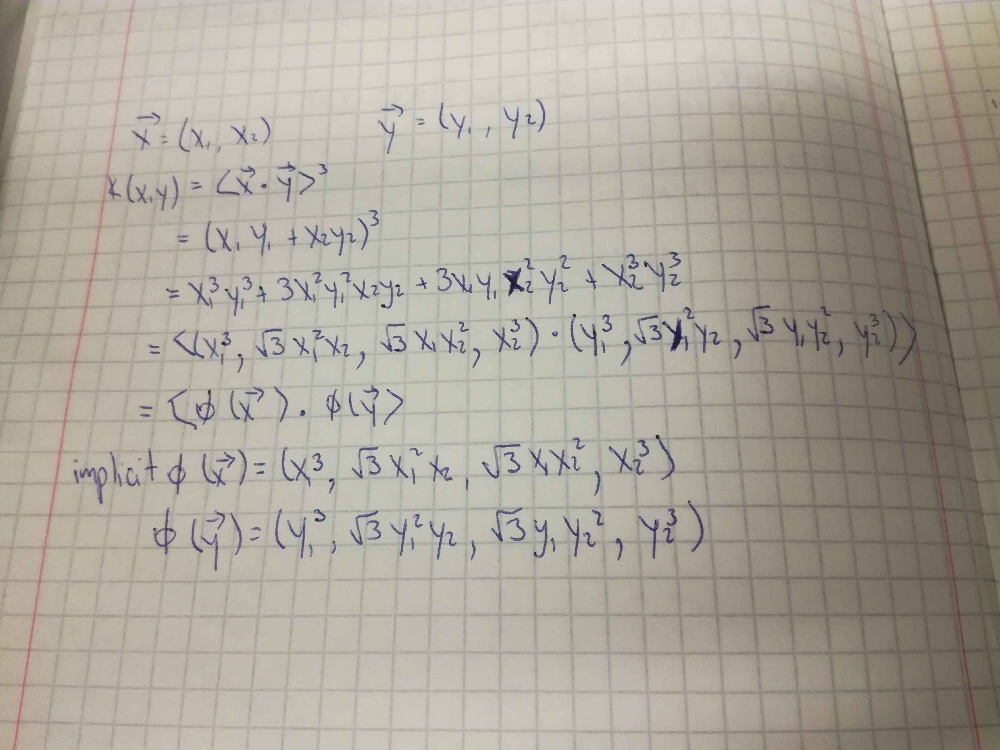

```{r setup, include=FALSE}
knitr::opts_chunk$set(echo = TRUE)
```

# Exercise 1

```{r}

```

The same procedure used for getting the kernel trick for a dot product on the power of 2 was used for generating the one on the power of 3. When the factors were divided into their different factors, then they were grouped in order to form a dot product.

# Exercise 2

Machine learning is learning from data. It will be one of the most important fields in the future, but there are not many resources right now in order to consolidate knowledge. Classifier is a system to which you add feature values and get in return a class.

All algorithms have three components: representation, evaluation and optimization. Representation puts the data into a machine readable format, evaluation checks if the classifier is good, and optimization gets the best classifiers.

Machine learning is about generalizing from a training set. Test data should be kept aside so that the classifier can be checked  against it. Cross validation can be used to test classifiers. Data is not enough. Assumptions have to be made in order to be flexible with new data.

Overfitting occurs when a model is very good on train data but bad on test data because it has been introduced quirks in it. Bias and variance is used to understand it. Different classifiers haave different ups and downs when comparing their bias and variance. Cross validation, regularization term, and chi-square reduce overfitting. Modern learners are able to test a lot of hypothesis and not just one.

Curse of dimensionality refers to models that behave well with low dimensions but poorly when there are a lot of them. Because our world is 3D, assumptions made here often do not work in higher dimensions. In real life, data is spread in a lower dimension, making it easier to work with.

Unlike previous knowledge said, we can get some kind of guarantee on induction, provided that we accept that there's some probabilistic guarantees. However, this could lead to bad assumptions like saying that a classifier will surely get the correct data with an infinite training set, or that a model returns a correct hypothesis if it has been provided a specific amount of data.

Most of the time dealt with data mining is used to clean the data for machine learning usage. It is a iterative process that has little time learning the data itself and more cleaning it and trying different things. Getting more data always beats improving an algorithm. Simple classifiers are favored because there's no time to learn complex ones. Learners can be either fixed size or can grow with data.

Having many models combined works much better than having just one. Bayesian model averaging is different, because it averages all classifier scores on one hypothesis, ensembles changes hypothesis.

There's no connection between the amount of parameters fed to a model and the overfit of it. Simpler hypothesis should be used instead of complex ones. A function that can be represented does not necessarily implies that it can be learned.

The goal of data mining is to get information that can be used in action. Even though correlation does not imply causation, sometimes the actual use of the information is limited.

# Exercise 3

```{r}
library(plotrix)

radius = 3
originX = 5
originY = 5

plot(c(0, 9), c(0, 9), type = "n", asp = 1)
draw.circle(originX, originY, radius, nv=100, border=NULL, col=NA, lty=1, lwd=1)
points(3,3, col="red")
points(6,6, col="blue")
points(2.8,2.8, col="gray")
points(4,8, col="orange")
points(9,9, col="green")

?points
```

```{r}
score <- function(x, y, oX, oY, radius){
  factorX = `^`((x - oX),2)
  factorY = `^`((y - oY),2)
  
  d = sqrt(factorX + factorY)
  
  return(radius - d)
}

```
```{r echo=FALSE}
m = matrix(c(3,3,score(3,3,originX,originY,radius),6,6,score(6,6,originX,originY,radius),2.8,2.8,score(2.8,2.8,originX,originY,radius),4,8,score(4,8,originX,originY,radius),9,9,score(9,9,originX,originY,radius)), ncol=3,byrow=TRUE)
colnames(m) = c("X", "Y", "Score")
as.table(m)
```

The score is calculated by measuring the difference between the circle edge and the center of the point. The formula for a circle is:

r^2 = (x-h)^2 + (y-i)^2

Where P(h,i) is the center of the circle, r is the radius of it, and P(x,y) is the point that we are evaluating. If the left factor is bigger than r^2, then the point is outside of the circle. Else, it is inside.

f(x) = {
  1 (outside), if (x-h)^2 + (y-i)^2 > r^2;
  0 (inside), otherwise
}

# Exercise 4-5


```{r}

set.seed(25)
random20 = data.frame(x = runif(20, 0.0, 10.0), y = runif(20, 0.0, 10.0))
random50 = data.frame(x = runif(50, 0.0, 10.0), y = runif(50, 0.0, 10.0))
random100 = data.frame(x = runif(100, 0.0, 10.0), y = runif(100, 0.0, 10.0))

insideCircle <- function(x, y, oX, oY, radius){
  
  score = score(x,y,oX,oY,radius)
  if (score > 0){
    return(TRUE)
  }
  else{
    return(FALSE)
  }
  
}

random20$inside = factor(apply(random20, 1, function(x) { insideCircle(x[1], x[2], originX, originY, radius) } ))
random50$inside = factor(apply(random50, 1, function(x) { insideCircle(x[1], x[2], originX, originY, radius) } ))
random100$inside = factor(apply(random100, 1, function(x) { insideCircle(x[1], x[2], originX, originY, radius) } ))

random20
```

## Decision Trees

```{r echo=FALSE}

library(rpart)
library(ggplot2)

generateGridData <- function(){
  return(data.frame(x = rep(seq(0, 10, 0.5), each=21), y = rep(seq(0, 10, 0.5), 21)))
}

```
```{r}
generateTreePrediction <- function(train){
  tree <- rpart(inside ~ x + y, data = train)
  test = generateGridData()
  
  test$inside = predict(tree, test, type = "class")
  
  plot <- ggplot(test, aes(x=x, y=y, color=inside)) + 
    geom_point() +
    annotate("path", x=originX+radius*cos(seq(0,2*pi,length.out=100)), y=originY+radius*sin(seq(0,2*pi,length.out=100)))
  
  return(plot)
}

```

### 20 points

```{r}
generateTreePrediction(random20)
```

### 50 points

```{r}
generateTreePrediction(random50)
```

### 100 points

```{r}
generateTreePrediction(random100)
```

### Explanation

We can see that, obviously, the tree with 100 points was a little bit more accurate in regards of getting closer to the desired shape. In a previous version, my decision tree for 20 points marked almost half of the graph as blue and the other half as red, but I lost it because I didn't set the seed. The current graph is just terrible when trying to predict. Also, the 50 point graph, although it identifies that there should be a form in the center, does a terrible job in determining what should be true on the X axis, making it a bad prediction. The 100 point graph is only missing the curvature of the circle, but it actually does a good job in predicting that there's a form in the center of the graph.

## Random Forest

```{r warning=FALSE, message=FALSE, echo=FALSE}
library(randomForest)
```
```{r}
generateForestPrediction <- function(train){
  forest <- randomForest(inside ~ ., train, ntree=10000)
  test = generateGridData()
  
  test$inside = predict(forest, test, type = "class")
  
  ggplot(test, aes(x=x, y=y, color=inside)) + 
    geom_point() +
    annotate("path", x=originX+radius*cos(seq(0,2*pi,length.out=100)), y=originY+radius*sin(seq(0,2*pi,length.out=100)))
}

```

### 20 points
```{r}
generateForestPrediction(random20)
```

### 50 points
```{r}
generateForestPrediction(random50)
```

### 100 points
```{r}
generateForestPrediction(random100)
```

### Explanation

Random forest gets much better prediction values than decision trees, especially for 20 and 50 points. Even with the low amount of points available for learning, random forests with ntree set at 10000 makes a decent on both 20 and 50. It is still far off from displaying a circle but it is much better than the pitiful tries from decision trees. Then with 100 points, we see that it does its best at trying to do a circle, trying to round the edges of the form in the center. However, there's not that much of a difference with the 100 points decision tree prediction.

## SVM Sigmoid Kernel

```{r echo=FALSE}
library("e1071")
```
```{r}
generateSVMSigmoidPrediction <- function(train){
  vectorMachine <- svm(inside ~ ., train, kernel = "sigmoid")
  test = generateGridData()
  
  test$inside = predict(vectorMachine, test, type = "class")
  
  ggplot(test, aes(x=x, y=y, color=inside)) + 
    geom_point() +
    annotate("path", x=originX+radius*cos(seq(0,2*pi,length.out=100)), y=originY+radius*sin(seq(0,2*pi,length.out=100)))
}
```

### 20 points
```{r}
generateSVMSigmoidPrediction(random20)
```

### 50 points

```{r}
generateSVMSigmoidPrediction(random50)
```

### 100 points

```{r}
generateSVMSigmoidPrediction(random100)
```

### Explanation

Even though we were recommended to use linear kernel at least for one exercise, I went against the recommendation because for me, it didn't predict anything, marking everything as red, so it was worthless. Although you could argue that sigmoid is even worse than linear because if predicts stuff in such a wrong way that it can't be seen as useful, at least it shows some blue spots. The worst case is the 100 points one, in which it marks true three different groups that aren't remotely close to the circle. It is definitely worthless for this analysis.

## SVM Radial Kernel

```{r}
generateSVMRadialPrediction <- function(train){
  vectorMachine <- svm(inside ~ ., train, kernel = "radial")
  test = generateGridData()
  
  test$inside = predict(vectorMachine, test, type = "class")
  
  ggplot(test, aes(x=x, y=y, color=inside)) + 
    geom_point() +
    annotate("path", x=originX+radius*cos(seq(0,2*pi,length.out=100)), y=originY+radius*sin(seq(0,2*pi,length.out=100)))
}
```

### 20 points

```{r}
generateSVMRadialPrediction(random20)
```

### 50 points

```{r}
generateSVMRadialPrediction(random50)
```

### 100 points

```{r}
generateSVMRadialPrediction(random100)
```

### Explanation

We can see that SVM with radial kernel yields the best results out of the four models. Even with 20 points, we can see a small circle forming. It is a bit to the side instead of the center but it kind of knows what is going on. Results get much better with 50 and especially with 100 points. The 100 point prediction is very good and it identifies the circle very accurately. It is better than random forest with 100 points, so this model is probably the most appropriate one for this kind of prediction.

# Exercise 6

## Sample Smiley Face

```{r echo=FALSE}

scoreEye <- function(x, y, eye){
  
  factorX = 0
  factorY = factorY = `^`((y - 6),2)
  
  if (eye == "left"){
    factorX = `^`((x - 3.5),2)
  }else if (eye == "right"){
    factorX = `^`((x - 6.5),2)
  }
  
  d = sqrt(factorX + factorY)
  
  return(0.2 - d)
}

scoreMouth <- function(x,y){
  
  if (y > 5){
    return(100)
  }
  
  factorY = factorY = `^`((y - 5),2)
  factorX = `^`((x - 5),2)
  
  d = sqrt(factorX + factorY)
  
  return(2 - d)
}

```
```{r}
randomSmiley = data.frame(x = runif(10000, 0.0, 10.0), y = runif(10000, 0.0, 10.0))
randomSmiley$paint = factor(apply(randomSmiley, 1, function(x) { 
    circleScore = score(x[1], x[2], originX, originY, radius)
    circleBool = (circleScore < 0.1 & circleScore > - 0.1)
    
    leftEyeScore = scoreEye(x[1], x[2], "left")
    leftEyeBool = (leftEyeScore < 0.1 & leftEyeScore > - 0.1)
    rightEyeScore = scoreEye(x[1], x[2], "right")
    rightEyeBool = (rightEyeScore < 0.1 & rightEyeScore > - 0.1)
    
    mouthScore = scoreMouth(x[1], x[2])
    mouthBool = (mouthScore < 0.1 & mouthScore > - 0.1)
    
    circleBool || leftEyeBool || rightEyeBool || mouthBool
    
  }  
))

ggplot(randomSmiley, aes(x=x, y=y, color=paint)) + 
  geom_point()


```

## Predicted Smiley Face with SVM

```{r}
generateSmileyPrediction <- function(train){
  vectorMachine = svm(paint ~ ., train, kernel = "radial", gamma=200)
  test = data.frame(x = runif(10000, 0.0, 10.0), y = runif(10000, 0.0, 10.0))
  
  test$paint = predict(vectorMachine, test, type = "class")
  
  paintOnly = subset(test, paint == TRUE)
  ggplot(paintOnly, aes(x=x, y=y, color=paint)) + 
    geom_point()
}

generateSmileyPrediction(randomSmiley)
```

In theory, radial basis function describes a function whose output is determined by the distance that the input supplied has from any origin. This is why it is so useful in trying to determine circular areas, because a circle is a line in which all points have the same distance to the origin. In this case, it should be helpful to determine the circumferences of the outer ring of the face, the smiley and the eyes, since all the elements are confined between a circle that has a determined origin.

## Predicted Smiley Face with Random Forest

```{r}
generateSmileyPredictionWithRF <- function(train){
  vectorMachine = randomForest(paint ~ ., train, ntree=500)
  test = data.frame(x = runif(10000, 0.0, 10.0), y = runif(10000, 0.0, 10.0))
  
  test$paint = predict(vectorMachine, test, type = "class")
  
  paintOnly = subset(test, paint == TRUE)
  ggplot(paintOnly, aes(x=x, y=y, color=paint)) + 
    geom_point()
}

generateSmileyPredictionWithRF(randomSmiley)
```

Just for reference, this is the prediction using random forests. It actually looks better using 500 in the ntree parameter than 1000.
